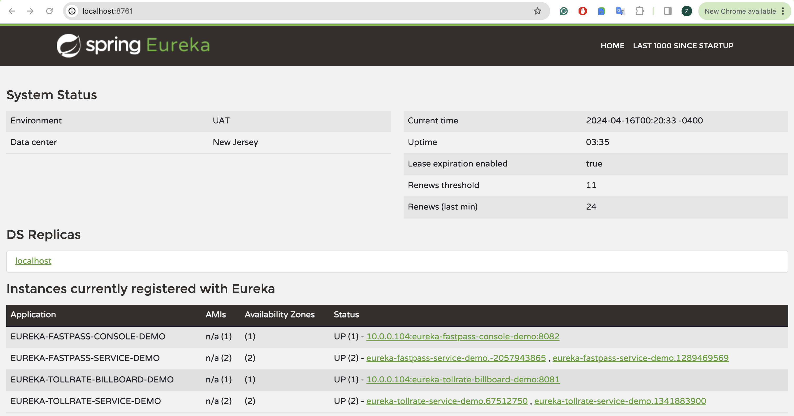
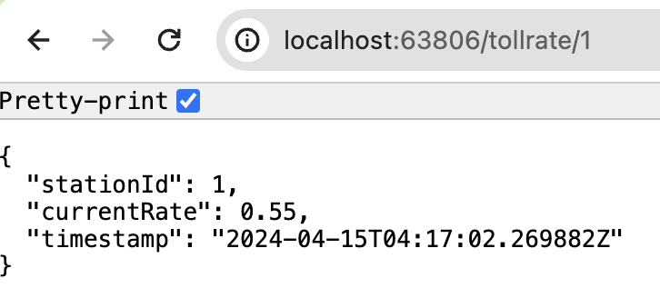
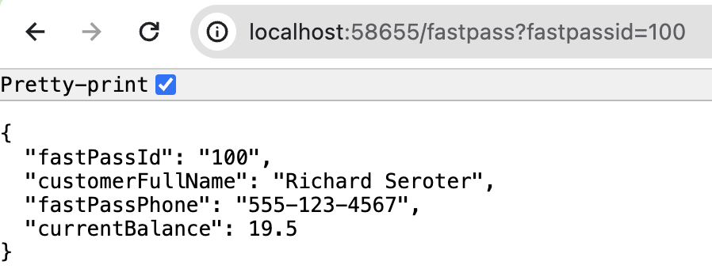
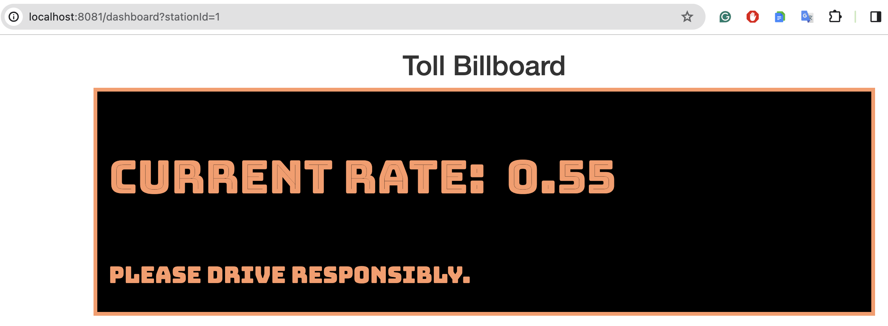
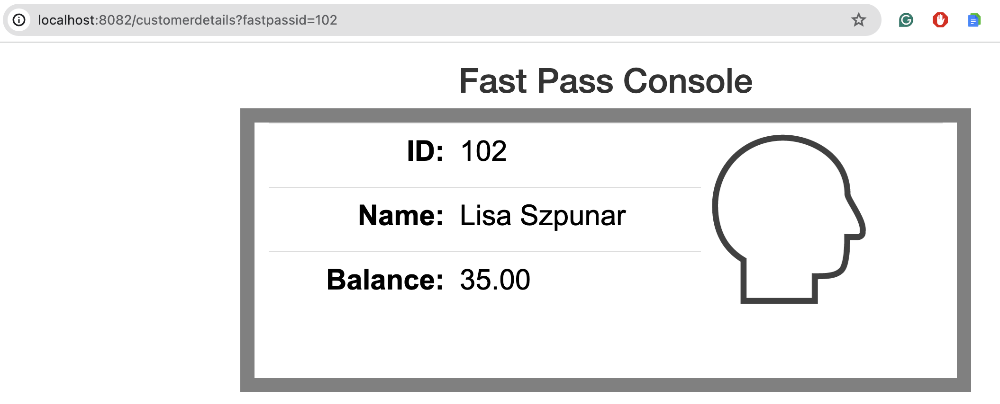

# spring-cloud-microservices

Step 1. Create a Eureka Server for Service Discovery

Step 2. Register Multiple Backend Services with Eureka
- Tollrate Service
- Fastpass Service

Step 3. Discover and Load Balance from the frontend
- Tollrate Billboard
- Fastpass Console

## DEMO
### 1. Eureka Dashboard with Registered Services & Instances

### 2. Registered Tollrate Backend Service with Eureka

### 3. Registered Fastpass Backend Service with Eureka

### 4. Discover & Load Balance Tollrate Frontend Service with Eureka

### 5. Discover & Load Balance Fastpass Frontend Service with Eureka

